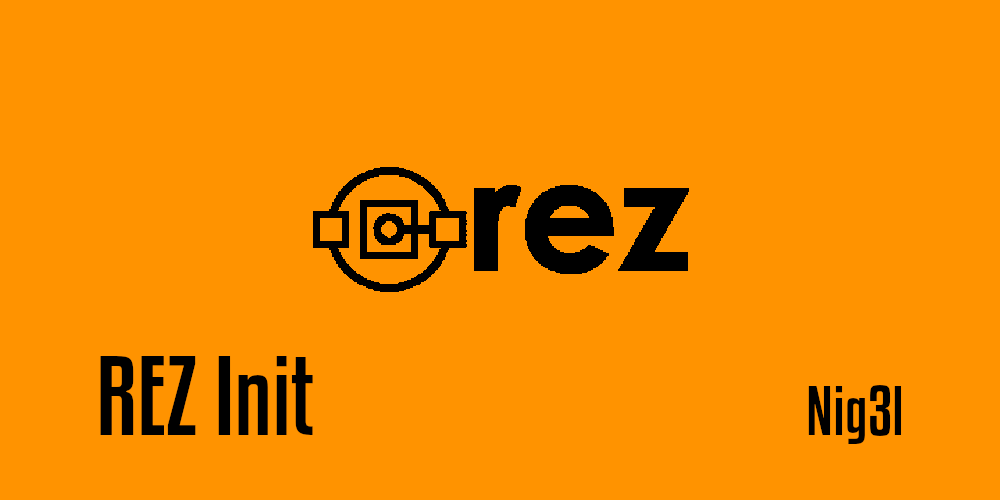

# Rez Command Extension : Init

Init Rez package from CookieCutter template.



This project was bootstrapped with [Rez init](https://github.com/Ni-g-3l/rez-init).

## 📤 Init command

In order to speed up the rez package creation you can run the following command : 

```
rez init
```

You have two types of template package : 
- Rez extension : As this one this template allows you to create custom rez command extension.
- Rez package : This template create basic package hierarchy and fill up for you package.py information

You can choose what kind of package you want to create with the following command :

```
rez init --type [package/extension] # package by default
```

Finally, you can customize which template is used for extension and package init by creating to environnement variable which point to the cookicutter of your choice.

```
export REZ_INIT_CUSTOM_EXTENSION_TEMPLATE=<your_extension_template>
export REZ_INIT_CUSTOM_PACKAGE_TEMPLATE=<your_package_template>
```

## ⚙️ Dev Commands

In the project directory, you can run:

### `make install`

Install Rez Init to your current rez environment.

### `make uninstall`

Uninstall Rez Init from your current rez environment.

### `make clean`

Remove all python run artefacts.

### `make coverage`

Launches a tool for measuring code coverage of Python programs. It monitors your program, noting which parts of the code have been executed, then analyzes the source to identify code that could have been executed but was not.

### `make test`

Launches the unittest test runner.

## 📥 Installation

1. Download latest version from [Release](https://github.com/Ni-g-3l/rez-init/releases)
2. Install it with the following commands :

```bash
rez python -m pip install <path_to_wheel>
```

## 🔢 Versioning

We use [SemVer](http://semver.org/) for versioning. For the versions available, see the [tags on this repository](https://github.com/Ni-g-3l/rez-init/tags).

## 🤹 Authors / Contributers / Attributions

* **Ni-g-3l** - *Main Developer* - [Github](https://github.com/Ni-g-3l/)

See also the list of [contributors](https://github.com/Ni-g-3l/rez-init/contributors) who participated in this project.

## 📃 License

This project is licensed under the MIT License - see the [LICENSE.md](LICENSE) file for details.

## 👏 Acknowledgments

* **Billie Thompson** - *README & Contribution Templates* - [PurpleBooth](https://github.com/PurpleBooth)
