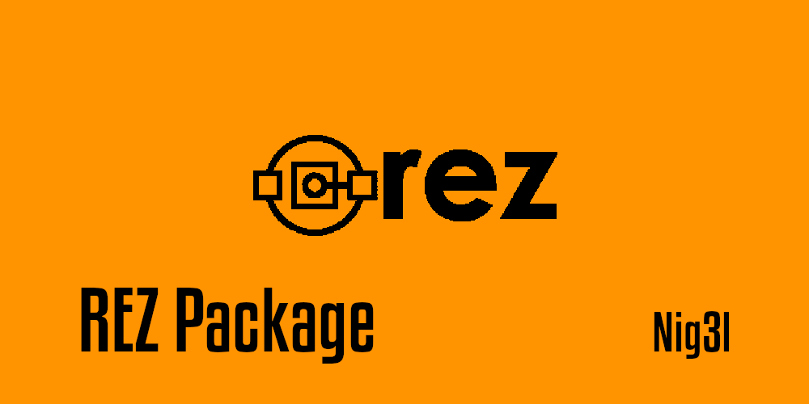

# Rez Package : {{cookiecutter.package_name}}

{{cookiecutter.package_description}} from CookieCutter template.



This project was bootstrapped with [Rez Init](https://github.com/Ni-g-3l/rez-init).

## 📤 {{cookiecutter.package_name}} command

{{cookiecutter.package_description}}

## ⚙️ Dev Commands

In the project directory, you can run :

### `make clean`

Remove all python run artefacts.

### `make coverage`

Launches a tool for measuring code coverage of Python programs. It monitors your program, noting which parts of the code have been executed, then analyzes the source to identify code that could have been executed but was not.

### `make test`

Launches the unittest test runner.

## 📥 Installation

1. Download latest version from [Release](https://github.com/Ni-g-3l/{{cookiecutter.package_name}}/releases)
2. Install it with the following commands :

```bash
rez python -m pip install <path_to_wheel>
```

## 🔢 Versioning

We use [SemVer](http://semver.org/) for versioning. For the versions available, see the [tags on this repository](https://github.com/Ni-g-3l/{{cookiecutter.package_name}}/tags).

## 🤹 Authors / Contributers / Attributions

See also the list of [contributors](https://github.com/Ni-g-3l/{{cookiecutter.package_name}}/contributors) who participated in this project.

## 📃 License

This project is licensed under the MIT License - see the [LICENSE.md](LICENSE) file for details.

## 👏 Acknowledgments

* **Billie Thompson** - *README & Contribution Templates* - [PurpleBooth](https://github.com/PurpleBooth)

* **Ni-g-3l** - *Template Rez package* - [Github](https://github.com/Ni-g-3l/)
